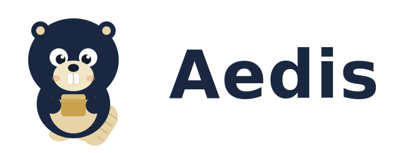

<picture>
  <source media="(prefers-color-scheme: dark)" srcset="aedis-mascot-lockup-dark.svg">
  
</picture>

### A fundação segura para construir serviços .NET orientados a domínio e a eventos.

<em>Golden-Path Platform · cloud-portable by design · secure by construction</em>

 

---

## O que estamos construindo

Na era do *vibe coding* — em que boa parte do código gerado por IA chega à produção com falhas de segurança — o **Aedis** entrega uma **Golden-Path Platform** .NET **segura por construção**. Autenticação, validação, tratamento de segredos, observabilidade e os padrões de *bounded context* já vêm corretos por padrão: a postura segura é o **caminho de menor resistência**, e a arquitetura é imposta **por construção**, não por convenção.

Não é greenfield. O Aedis nasce da **extração de um framework .NET 10 em produção** — destilando o que já roda numa frota de microsserviços de pagamentos em blocos reutilizáveis. É padrão de produção provado, não promessa.

Modelamos o domínio primeiro; a tecnologia vem depois — e fica fora do caminho.

## Os blocos de construção

O Aedis é um conjunto de pacotes `Aedis.*` organizados em camadas claras:

- 🧩 **Contratos** (`Aedis.Core`, `Aedis.*.Abstractions`) — abstrações puras, sem dependência de infraestrutura.
- ⚙️ **Implementações por provider** (`Aedis.Messaging.RabbitMq`, `Aedis.Database.Postgres`, `Aedis.Cache.Redis`, …) — substituíveis.
- 📦 **Meta-pacote** (`Aedis.Build`, *batteries-included*) — onboarding rápido, com *opt-in complexity* quando precisar de granularidade.

Seu código de domínio depende **só de contratos**. Portar entre nuvem, broker ou banco é **trocar um pacote NuGet** no *composition root* — o domínio nem recompila. Chamamos isso de *package-level Dependency Inversion*.

## A arquitetura, sem rótulo único

Dizer só "hexagonal" subvende o Aedis — ele opera em **três níveis**, e hexagonal cobre apenas um:

| Camada | Padrão | No Aedis |
|---|---|---|
| **Domínio & fronteiras** | Hexagonal / Ports & Adapters | `*.Abstractions` (portas) ↔ implementações por provider (adaptadores) |
| **Plataforma & pacotes** | Microkernel / Plug-in | `Aedis.Core` (kernel estável) + plug-ins substituíveis por *package swap* |
| **Hosting** | Framework IoC / Template Method | `WebApiHost`/`StandaloneApp` invertem o controle e entregam o *golden path* |

> **Hexagonal no domínio, Microkernel na plataforma.** Portabilidade por troca de pacote é o padrão Microkernel — não hexagonal puro. É o que diferencia o Aedis de "qualquer monolito bem-feito": os adaptadores são **plug-ins versionados e publicáveis de forma independente**.

## Segura **e** portável por construção

Os mesmos princípios que tornam o código seguro também o tornam **independente de nuvem**: domínio no centro, infraestrutura nas bordas, comunicação por eventos. O custo de portar é **pré-pago no design** — toda dependência de infra vive atrás de uma interface agnóstica.

Em **mensageria, banco de dados e observabilidade** a portabilidade é executável hoje; em outras capacidades o contrato já é agnóstico e o adapter é trabalho contido. Nosso objetivo é deixar os ambientes das empresas **aptos a rodar tanto em AWS quanto em Azure**, com o mínimo de retrabalho para alternar ou combinar provedores — *cloud-portable / polycloud-ready*, a base da nossa oferta de **migrações de baixo impacto**.

## Evidência, não selos

Credibilidade que um arquiteto consegue **auditar**, não adjetivos:

- 📡 **OpenTelemetry-native** (OTLP) — observabilidade *vendor-neutral*, projeto CNCF graduado.
- ☁️ **CloudEvents v1.0** — eventos em especificação CNCF, conformância atestável.
- 🏛️ **Well-Architected** (AWS/Azure) como rubrica — *operational excellence*, *security*, *reliability*, *performance*.
- 🛡️ **Supply-chain verificável** — SBOM, build determinístico, assinatura de pacote e *provenance* como portões de release.

## O ecossistema

- 🧱 **Framework open source** — o Aedis é, e seguirá sendo, Apache-2.0. Sem pegadinhas de licença.
- 🤝 **Comunidade** — conteúdo técnico, padrões de arquitetura e linguagem ubíqua compartilhada.
- 🛠️ **Ferramentas de portabilidade** — contratos agnósticos e *package swap* para reduzir o atrito de trocar (ou combinar) provedores.
- 🎓 **Consultoria & treinamento** — arquitetura orientada a domínio, eventos e cloud, com segurança desde o dia zero.
- ☁️ **Parcerias de cloud** — aceleração de projetos seguros com IA junto aos principais provedores.

## Para empresas

Levamos a mesma filosofia do framework para dentro das organizações — ajudando times a modernizar plataformas sem reescrever o negócio do zero:

- 🚀 **Inovação tecnológica** — desenho e construção de soluções novas, seguras por construção, prontas para escalar.
- ☁️ **Migração para a cloud** — saída de *on-premise* para a nuvem com arquitetura desacoplada e risco controlado.
- 🔀 **Estratégia polycloud & portabilidade** — ambientes prontos para **AWS e Azure**, reduzindo *lock-in* e migrando entre provedores com o menor impacto possível.
- 🔍 **Revisão arquitetural & tecnológica** — diagnóstico e evolução de plataformas existentes rumo a mais segurança, observabilidade e performance.
- 🧭 **Transformação digital** — modernização guiada por domínio, do legado à plataforma orientada a eventos.

## Comece por aqui

- 📦 **Framework:** [`aedis-build/aedis`](https://github.com/aedis-build/aedis)
- 🌐 **Site:** [aedis.build](https://aedis.build)

---

Sistemas orientados a domínio, distribuídos por eventos, portáveis entre nuvens e com ownership claro de dados — seguros e cloud-native por construção.

